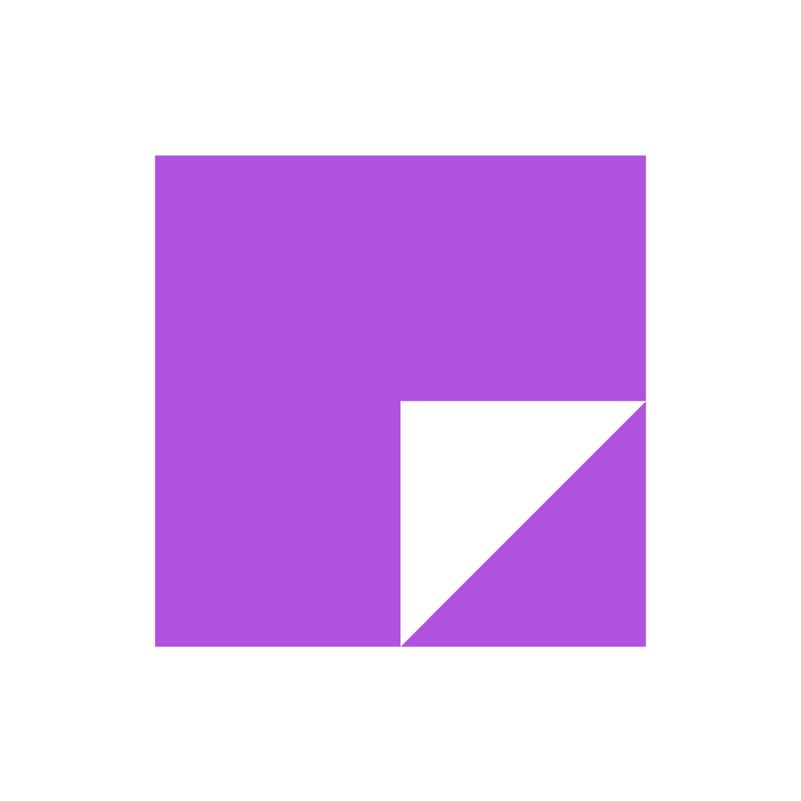

<div align="center">
  
  <h1>Metro Notes</h1>
  <p>A metro-themed notes app inspired by OneNote for Windows Phone 8</p>
  <a href="https://github.com/ghplayer2000/metro-notes/releases">
    
  </a>
</div>

## About

Metro Notes is a simple and elegant notes application inspired by the classic OneNote design from Windows Phone 8.  It offers a clean, distraction-free environment for capturing your thoughts, ideas, and to-dos.

## Features

*   **Create and Save Notes:**  Easily write and save your notes.
*   **Timestamps:**  Notes are automatically timestamped for easy organization.
*   **Rich Formatting:**  Format your text with various styling options.
*   **Image Support:**  Embed images directly into your notes.
*   **Smooth Animations:**  Enjoy a fluid and responsive user experience.
*   **Dark Mode:**  Switch to dark mode for comfortable nighttime use.
*   **Search (Coming Soon):**  A search feature is planned for future releases.

## Screenshots

## Download

*  **[Github Releases](https://github.com/ghplayer2000/metro-notes/releases)**
*  **[Web Demo](https://ghplayer2000.github.io/metro-notes)**

## Building from Source

If you'd like to build Metro Notes yourself:

1.  Clone the Repository:
    ```bash
    git clone https://github.com/ghplayer2000/metro-notes.git
    ```

2.  Prepare Assets: Copy all files into the `/android/app/src/main/assets/web_content/` directory.

3.  **Build with Android Studio:** Open the `/android` directory in Android Studio, Build and run the project.

